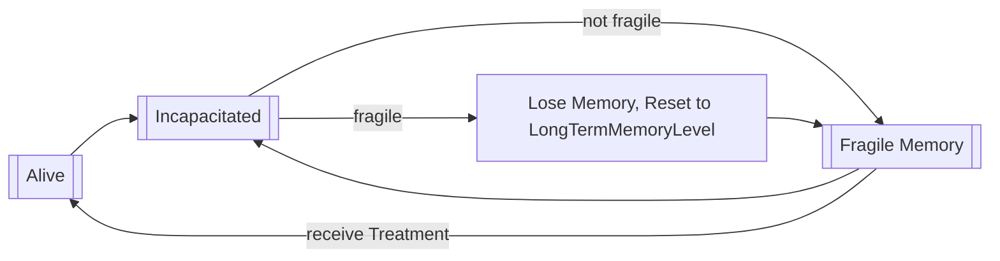

# Amnesia

[](https://7daystodie.com/) [](https://github.com/jonathan-robertson/amnesia/actions/workflows/release.yml)


- [Amnesia](#amnesia)
  - [Summary](#summary)
    - [Support](#support)
  - [Features](#features)
    - [Memory Loss](#memory-loss)
    - [Memory Treatment](#memory-treatment)
    - [Memory Therapy](#memory-therapy)
  - [Admin Configuration](#admin-configuration)
    - [Core Options](#core-options)
    - [DISABLED ~~Experimental Options~~](#disabled-experimental-options)
    - [File Example](#file-example)
  - [Setup](#setup)
    - [Environment / EAC / Hosting Requirements](#environment--eac--hosting-requirements)
    - [Map Considerations for Installation or Uninstallation](#map-considerations-for-installation-or-uninstallation)
    - [Windows/Linux Installation (Server via FTP from Windows PC)](#windowslinux-installation-server-via-ftp-from-windows-pc)
    - [Linux Server Installation (Server via SSH)](#linux-server-installation-server-via-ssh)
  - [Philosophy](#philosophy)
  - [Attribution](#attribution)

## Summary

As you may have guessed, this mod adds a RogueLike element to 7 Days to Die in a way that runs entirely on the server's end and **does not require players to manually download or install anything**.

> 🔍 This mod *only* runs on a dedicated server which you can technically run locally and will need to connect to. If you're only looking for a client-side/single-player experience, consider [Mostly Dead](https://7daystodiemods.com/mostly-dead/) by [Khzmusik](https://7daystodiemods.com/tag/khzmusik/).

### Support

🗪 If you would like support for this mod, please feel free to reach out via [Discord](https://discord.gg/tRJHSB9Uk7).

## Features

The Primary Goal of this mod is to improve long-term engagement by introducing a *far* heavier risk/reward play style that should mix well with a post-apocalyptic survival experience.

The Secondary Goal is to take a meaningful step toward 'evergreen' servers by reducing how often map wipes need to occur due to total exhaustion of all challenge to the players (i.e. when most players have reached max level and no longer feel they have anything exciting to work towards). So even though it is the case that other reasons for wiping a map may be unavoidable, Amnesia is meant to help with player engagement/boredom/challenge/etc.

### Memory Loss

After reaching an admin-configurable level (which defaults to 1), a player will receive the debuff `Fragile Memory` upon death, along with `Near Death Trauma` and an XP Debt to work off.

Dying with the `Fragile Memory` debuff will cause a player to **Lose Memory**, resulting in *no* XP Debt or the `Near Death Trauma` debuff, but will trigger a series of admin-configurable changes to the player: levels being reset, forgetting books/schematics/crafting, even forgetting kill stats for pvp/death/zombies. More details on settings and defaults are listed in the [Admin Configuration](#admin-configuration) section.

### Memory Treatment

Players can recover from `Fragile Memory` with the help of the new `Treatment` service offered by any Trader.



- ⚖️ The cost of this service will depend on the Player's current Level, so continued success eventually becomes a heavier burden.
  - This is meant to increase the pressure as a player grows in level and also offset the ease at which a player will eventually be able to produce money.
- 🛡️ This dialog-based services approach prevents skills like Better Barter or consumables such as Pumpkin Cheesecake from having any impact on the cost of `Treatment`.
- ⚙️ Higher XP growth is generally recommended; possibly 2x or 3x. Regular xp growth can be used, but may be very challenging. This is definitely something worth discussing with your community if you want to try to keep the server engaging for all players past 3-4 months (your mileage may vary).

### Memory Therapy

`Grandpa's Fergit'n Elixir` has been removed from the game so its cost can be based on player level. Just like `Treatement`, players will find `Therapy` services offered by any trader.

- ⚖️ The cost of this service will depend on the Player's current Level... the larger your skill point pool to reassign, the higher the cost.
- 🪙 This should help to encourage lower-level players to invest in skill reassignment earlier instead of putting it off for later.
- 🤝 I expect this will encourage division of responsibilities on teams vs everyone reclassifying as loot monsters or miners as the team is building up resources.

## Admin Configuration

Every single one of these settings can be adjusted from the admin console *live* and should take all considerations into account for you automatically. If you see *any issue* with these at all, please reach out by creating a new [GitHub Issue](https://github.com/jonathan-robertson/amnesia/issues) and I'll take a look!

### Core Options

Option Name | Default | Description
--- | :---: | ---
LongTermMemoryLevel | 1 | The number of levels a player must exceed before Memory Loss on death begins. This will also represent the level a player is reset to on death (if Memory Loss is not prevented in some way: PVP, Blood Moon, or Memory Boosters).
PositiveOutlookMaxTime | 3600 | The maximum number of seconds that can be acquired for the Positive Outlook buff (2x XP boost).
PositiveOutlookTimeOnFirstJoin | 3600 | How many seconds of Positive Outlook buff to grant a brand new player to the server.
PositiveOutlookTimeOnMemoryLoss | 3600 | How many seconds of Positive Outlook buff to grant a player who just experienced Memory Loss.
PositiveOutlookTimeOnKillName | Empty | Names and Values to reward the entire server when any player defeats the given entity. This is best applied to boss zombies such as Vanilla's `zombieDemolition` and modded zombies. *Note that this value is adjusted with the **list** command rather than the **set** command; see admin console for more details.*
ProtectMemoryDuringBloodmoon | true | Whether deaths during Blood Moon will be PREVENTED from causing Memory Loss.
ProtectMemoryDuringPvp | true | Whether deaths due to PVP will be PREVENTED from causing Memory Loss.
ForgetLevelsAndSkills | true | Whether to forget levels, skills, and skill points on Memory Loss.
ForgetBooks | false | Whether books should be forgotten on memory loss. It's recommended to keep this as `false` because A21 is expected to have hundreds of books to collect for crafting purposes.
ForgetCrafting | false | Whether crafting magazines should be forgotten on memory loss.
ForgetSchematics | false | Whether schematics should be forgotten on memory loss.
ForgetKdr | false | Whether players/zombies killed and times died should be forgotten on memory loss.

### DISABLED ~~Experimental Options~~

> ⚠️ While it is possible to remove completed quests from a remote player, the trader relationship dictionary is managed on the client's end and does not currently reflect those removals... this results in the player reward system getting real jacked up; tier unlock milestone rewards end up getting offered again and then no quests can be accepted.
> 🤞 I'm hoping to support this in the future if I can figure out a way to update Trader Relationships without requiring the player to be disconnected.

Option Name | Default | Description
--- | :---: | ---
NameForgetNonIntroQuests | false | [DISABLED FOR NOW] whether to forget non-intro quests (and trader tier levels) on memory loss

### File Example

Here's an example of what I'm trying out on my server. All of these options can be set individually via the admin console / telnet, or you could simply create an `amnesia.xml` file within your map's instance directory (the same folder you'll find your server's `players.xml` file in).

```xml
<config>
  <LongTermMemoryLevel>50</LongTermMemoryLevel>
  <PositiveOutlookMaxTime>3600</PositiveOutlookMaxTime>
  <PositiveOutlookTimeOnFirstJoin>0</PositiveOutlookTimeOnFirstJoin>
  <PositiveOutlookTimeOnMemoryLoss>0</PositiveOutlookTimeOnMemoryLoss>
  <PositiveOutlookTimeOnKill>
    <entry name="zombieScorcherPLUS" caption="[FF007F]Scorcher[-]" value="900" />
    <entry name="zombieWightRadiationShowerPLUS" caption="[FAE500]Radiation Shower Wight[-]" value="300" />
    <entry name="zombieDemolition" caption="[8000FF]Demolition Zombie[-]" value="60" />
  </PositiveOutlookTimeOnKill>
  <ProtectMemoryDuringBloodmoon>true</ProtectMemoryDuringBloodmoon>
  <ProtectMemoryDuringPvp>true</ProtectMemoryDuringPvp>
  <ForgetLevelsAndSkills>true</ForgetLevelsAndSkills>
  <ForgetBooks>false</ForgetBooks>
  <ForgetCrafting>false</ForgetCrafting>
  <ForgetSchematics>false</ForgetSchematics>
  <ForgetKdr>false</ForgetKdr>
  <ForgetNonIntroQuests>false</ForgetNonIntroQuests>
</config>
```

> 📝 a few of the zombies I'm referencing come from [Server Side Zombies PLUS](https://7daystodiemods.com/server-side-zombies-plus/).

## Setup

Without proper installation, this mod will not work as expected. Using this guide should help to complete the installation properly.

If you have trouble getting things working, you can reach out to me for support via [Support](#support).

### Environment / EAC / Hosting Requirements

Environment | Compatible | Does EAC Need to be Disabled? | Who needs to install?
--- | --- | --- | ---
Dedicated Server | Yes | no | only server
Peer-to-Peer Hosting | [Not Yet](https://github.com/jonathan-robertson/amnesia/issues/73) | only on the host | only the host
Single Player Game | [Not Yet](https://github.com/jonathan-robertson/amnesia/issues/73) | Yes | self (of course)

> 🤔 If you aren't sure what some of this means, details steps are provided below to walk you through the setup process.

### Map Considerations for Installation or Uninstallation

- Does **adding** this mod require a fresh map?
  - No! You can drop this mod into an ongoing map without any trouble.
- Does **removing** this mod require a fresh map?
  - No! You can remove this mod from an ongoing map without any trouble.
  - Any buffs currently applied to players from this mod will be silently removed when they log in next.
  - Journal Entries added to the player Journal will unfortunately remain with their Localization stubs (but will otherwise have no text within them and will not impact gameplay at all).

### Windows/Linux Installation (Server via FTP from Windows PC)

1. 📦 Download the latest release by navigating to [this link](https://github.com/jonathan-robertson/amnesia/releases/latest/) and clicking the link for `amnesia.zip`
2. 📂 Unzip this file to a folder named `amnesia` by right-clicking it and choosing the `Extract All...` option (you will find Windows suggests extracting to a new folder named `amnesia` - this is the option you want to use)
3. 🕵️ Locate and create your mods folder (if missing):
    - Windows PC or Server: in another window, paste this address into to the address bar: `%APPDATA%\7DaysToDie`, then enter your `Mods` folder by double-clicking it. If no `Mods` folder is present, you will first need to create it, then enter your `Mods` folder after that
    - FTP: in another window, connect to your server via FTP and navigate to the game folder that should contain your `Mods` folder (if no `Mods` folder is present, you will need to create it in the appropriate location), then enter your `Mods` folder. If you are confused about where your mods folder should go, reach out to your host.
4. 🚚 Move this new `amnesia` folder into your `Mods` folder by dragging & dropping or cutting/copying & pasting, whichever you prefer
5. ♻️ Restart your server to allow this mod to take effect and monitor your logs to ensure it starts successfully:
    - you can search the logs for the word `Amnesia`; the name of this mod will appear with that phrase and all log lines it produces will be presented with this prefix for quick reference

### Linux Server Installation (Server via SSH)

1. 🔍 [SSH](https://www.digitalocean.com/community/tutorials/how-to-use-ssh-to-connect-to-a-remote-server) into your server and navigate to the `Mods` folder on your server
    - if you installed 7 Days to Die with [LinuxGSM](https://linuxgsm.com/servers/sdtdserver/) (which I'd highly recommend), the default mods folder will be under `~/serverfiles/Mods` (which you may have to create)
2. 📦 Download the latest `amnesia.zip` release from [this link](https://github.com/jonathan-robertson/amnesia/releases/latest/) with whatever tool you prefer
    - example: `wget https://github.com/jonathan-robertson/amnesia/releases/latest/download/amnesia.zip`
3. 📂 Unzip this file to a folder by the same name: `unzip amnesia.zip -d amnesia`
    - you may need to install `unzip` if it isn't already installed: `sudo apt-get update && sudo apt-get install unzip`
    - once unzipped, you can remove the amnesia download with `rm amnesia.zip`
4. ♻️ Restart your server to allow this mod to take effect and monitor your logs to ensure it starts successfully:
    - you can search the logs for the word `Amnesia`; the name of this mod will appear with that phrase and all log lines it produces will be presented with this prefix for quick reference
    - rather than monitoring telnet, I'd recommend viewing the console logs directly because mod and DLL registration happens very early in the startup process and you may miss it if you connect via telnet after this happens
    - you can reference your server config file to identify your logs folder
    - if you installed 7 Days to Die with [LinuxGSM](https://linuxgsm.com/servers/sdtdserver/), your console log will be under `log/console/sdtdserver-console.log`
    - I'd highly recommend using `less` to open this file for a variety of reasons: it's safe to view active files with, easy to search, and can be automatically tailed/followed by pressing a keyboard shortcut so you can monitor logs in realtime
      - follow: `SHIFT+F` (use `CTRL+C` to exit follow mode)
      - exit: `q` to exit less when not in follow mode
      - search: `/Amnesia` [enter] to enter search mode for the lines that will be produced by this mod; while in search mode, use `n` to navigate to the next match or `SHIFT+n` to navigate to the previous match

## Philosophy

I want for there to be a way to keep maps/players in a 'healthy' state of play for 6 months or beyond - perhaps even getting to the point where maps can be evergreen: keeping a map active until the following 7 Days to Die Alpha Release (barring patches that The Fun Pimps determine will require map wipes).

As an 7DTD admin and modder for a few years now, I've noticed some problematic patterns and this mod was created to take a stab at addressing some of them.

> 📊 Progression is a core piece of any RPG. Once the opportunity to progress has faded or become convoluted, player engagement/enjoyment evaporates with time.

Observation | Problem | How Amnesia attempts to address it
--- | --- | ---
Many admins wipe maps within 1-2 months - often for reasons related to map corruption (not addressed in this mod) or player balance. | New players are often discouraged the steep level difference between them and others who started earlier while more casual players are discouraged from the raging progress of highly engaged players. | Dynamic rebalancing of the risk/reward structure that directly impacts player progress offers a new challenge for engaged players and rewards the more cautious play style of casuals. It also provides hope for the new players that if they play carefully, they can grow in level and meet other more aggressive players where they are. More details about each of these player types in subsequent rows.
Wasteland GameStage changes are... game breaking: Level 50 players in Wasteland will be looting end-game, max level gear. | Wasteland is really cool and I love the changes TFP made, but dying does not currently provide a significant deterrent to acquiring all the end-game gear. | There is NO REASON to avoid Wasteland since it's a treasure-trove. Rather than nerfing Wasteland, I find it much more fulfilling to provide a meaningful but not debilitating drawback to death: dynamic, configurable player state reset. Additional suggestions are to gate the Wasteland behind instant-death radiation without a full rad suit similar to Darkness Falls (see standalone mod [Radiation Wasteland – Server Side](https://7daystodiemods.com/radiation-wasteland-server-side/)) or add an environmental effect to limit time spent in the Wasteland (see [Immersive Radiation for the Wasteland](https://7daystodiemods.com/immersive-radiation-for-the-wasteland/)).
Highly Engaged Players log in regularly and level up quickly. | These same players burn out of maps quickly and become disengaged. | Amnesia rewards the risky behavior and thrill-seeking growth that Highly Engaged Players pursue and meets them with a greater challenge to avoid dying. Dying enough will reset their levels (and more, if configured), but will also encourage them with a one-time hour-long XP boost to encourage further engagement.
New/Casual/Cautious Players have a hard time feeling like they can't catch up to others. | This discourages new players from sticking with a server community for long since they don't have time time to invest in keeping up with highly engaged players and encourages. So they leave for another server that's more "fresh" or they leave 7DTD entirely. | Amnesia supports variable progression that can be tuned by the admin. Level and KDR stat resets help to keep these players feeling like they have the opportunity to advance in meaningful ways. Cautious players will simply die less often since they're more risk adverse. While their growth will be slower, they will maintain their growth more often.

> :warning: *I will admit Amnesia is not the kind of thing I expect all players will prefer. Keep this in mind and discuss with your community if this is something they're comfortable trying out. I'd encourage an open dialog about options/settings so there are no unpleasant surprises or unnecessary drama when player characters eventually suffer memory loss.*

## Attribution

- Much thanks to [all-free-download.com](https://all-free-download.com/free-vector/download/brain_icon_shiny_dark_blue_design_6833698.html) for the brain image used in this logo's background.
