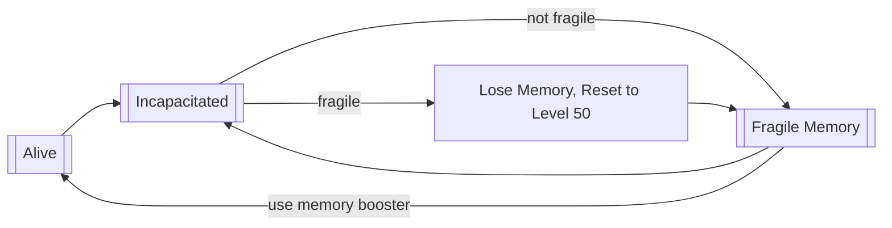

# Amnesia

[](https://7daystodie.com/) [](https://github.com/jonathan-robertson/amnesia/actions/workflows/release.yml)


- [Amnesia](#amnesia)
  - [Summary](#summary)
  - [Flow](#flow)
  - [Admin Configuration](#admin-configuration)
    - [Experimental/Volatile Options](#experimentalvolatile-options)
    - [File Example](#file-example)
  - [Compatibility](#compatibility)
  - [Philosophy](#philosophy)
  - [Attribution](#attribution)

## Summary

As you may have guessed, this mod adds a Roguelike element to 7 Days to Die in a way that runs entirely on the server's end and **does not require players to manually download or install anything**.

> :mag: This mod *only* runs on a dedicated server which you can technically run locally and will need to connect to. If you're only looking for a client-side/single-player experience, consider [Mostly Dead](https://7daystodiemods.com/mostly-dead/) by [Khzmusik](https://7daystodiemods.com/tag/khzmusik/).

After reaching an admin-configurable level (which defaults to 1), a player will receive the debuff `Fragile Memory` upon death, along with `Near Death Trauma` and an XP Debt to work off.

Dying with the `Fragile Memory` debuff will cause a player to **Lose Memory**, resulting in *no* XP Debt or the `Near Death Trauma` debuff, but will trigger a series of admin-configurable changes to the player: levels being reset, forgetting books/schematics, even forgetting kill stats for pvp, death, and zombies. More details on settings and defaults are listed in the [Admin Configuration](#admin-configuration) section.

Players can recover from `Fragile Memory` with the help of `Trader Jen's Memory Booster`: a non-craftable item that all traders sell for a very high price... so it will require effort to save up for.

The Primary Goal is to improve long-term engagement by introducing a *far* heavier risk/reward play style that should mix well with a post-apocalyptic survival experience.

The Secondary Goal is to take a meaningful step toward 'evergreen' servers by reducing how often map wipes need to occur due to total exhaustion of all challenge to the players (i.e. when most players have reached max level and no longer feel they have anything exciting to work towards). While it is the case that other reasons for wiping a map may be unavoidable, Amnesia is meant to help with player engagement/boredom/challenge/etc.

> 💭 Higher XP growth is recommended; possibly 2x or 3x. Regular xp growth can be used, but may be very challenging. This is definitely something worth discussing with your community if you want to try to keep the server engaging for all players past 3-4 months (your mileage may vary).

## Flow



## Admin Configuration

> ℹ️ Every single one of these settings can be adjusted from the admin console *live* and should take all considerations into account for you automatically. If you see *any issue* with these at all, please reach out by creating a new [GitHub Issue](https://github.com/jonathan-robertson/amnesia/issues) and I'll take a look!

Option Name | Default | Description
--- | :---: | ---
LongTermMemoryLevel | 1 | The number of levels a player must exceed before Memory Loss on death begins. This will also represent the level a player is reset to on death (if Memory Loss is not prevented in some way: PVP, Blood Moon, or Memory Boosters).
PositiveOutlookMaxTime | 3600 | The maximum number of seconds that can be acquired for the Positive Outlook buff (2x XP boost).
PositiveOutlookTimeOnFirstJoin | 3600 | How many seconds of Positive Outlook buff to grant a brand new player to the server.
PositiveOutlookTimeOnMemoryLoss | 3600 | How many seconds of Positive Outlook buff to grant a player who just experienced Memory Loss.
PositiveOutlookTimeOnKillName | Empty | Names and Values to reward the entire server when any player defeats the given entity. This is best applied to boss zombies such as Vanilla's `zombieDemolition` and modded zombies. *Note that this value is adjusted with the **list** command rather than the **set** command; see admin console for more details.*
ProtectMemoryDuringBloodmoon | true | Whether deaths during Blood Moon will be PREVENTED from causing Memory Loss.
ProtectMemoryDuringPvp | true | Whether deaths due to PVP will be PREVENTED from causing Memory Loss.
ForgetLevelsAndSkills | true | Whether to forget levels, skills, and skill points on Memory Loss.
ForgetBooks | false | Whether books should be forgotten on memory loss. It's recommended to keep this as `false` because A21 is expected to have hundreds of books to collect for crafting purposes.
ForgetSchematics | false | Whether schematics should be forgotten on memory loss. *It's recommended to keep this as `false` because A21 is expected to no longer grant crafting recipes when learning skills, so finding/using schematics will be the only way to learn how to craft things.* ***Note that `false` can cause some confusion in A20 because schematics will appear to have been read if the corresponding recipe was already unlocked in a Skill/Perk. The code for how this works is inside C# on the client's end, so changing it for a server-side mod does nto appear to be possible... but again, all the confusion will be gone in A21.***
ForgetKdr | false | Whether players/zombies killed and times died should be forgotten on memory loss. *I'd strongly recommend setting this to `true`, but have left it as `false` by default only because these metrics can't be recovered once wiped and some admins might not want them to reset for that reason.*

### Experimental/Volatile Options

⚙️ I do have a better solution for this (most likely) but it will be in a future update. It's a low priority for me right now since our players aren't interested in quests being reset... but if your players are, please reach out to me in discord or post a comment to [Issue #57](https://github.com/jonathan-robertson/amnesia/issues/57).

> ⚠️ THESE OPTIONS WILL DISCONNECT THE PLAYER FROM THE SERVER ON FINAL DEATH. THEY ARE TO BE CONSIDERED EXPERIMENTAL AND MAY NOT WORK EXACTLY AS YOU'D LIKE.

The reason for the disconnection requirement has to do with Quests currently being managed in an isolated way on the client - not the server. For me to adjust quests for a player, it's necessary to disconnect that player and manipulate the PlayerDataFile (player save) while the player is offline.

Option Name | Default | Description
--- | :---: | ---
ForgetActiveQuests | false | Whether ongoing quests should be forgotten on memory loss.
ForgetInactiveQuests | false | Whether completed quests (AND TRADER TIER LEVELS) should be forgotten on memory loss.
ForgetIntroQuests | false | Whether the intro quests should be forgotten/reset on memory loss.

### File Example

Here's an example of what I'm trying out on my server. All of these options can be set individually via the admin console / telnet, or you could simply create an `amnesia.xml` file within your map's instance directory (the same folder you'll find your server's `players.xml` file in).

```xml
<config>
  <LongTermMemoryLevel>50</LongTermMemoryLevel>
  <PositiveOutlookMaxTime>3600</PositiveOutlookMaxTime>
  <PositiveOutlookTimeOnFirstJoin>0</PositiveOutlookTimeOnFirstJoin>
  <PositiveOutlookTimeOnMemoryLoss>0</PositiveOutlookTimeOnMemoryLoss>
  <PositiveOutlookTimeOnKill>
    <entry name="ZombieJuggernaut" caption="[FF8000]Juggernaut[-]" value="900" />
    <entry name="zombieScorcher" caption="[FF007F]Scorcher[-]" value="300" />
    <entry name="zombieDemolition" caption="[8000FF]Demolition Zombie[-]" value="60" />
  </PositiveOutlookTimeOnKill>
  <ProtectMemoryDuringBloodmoon>true</ProtectMemoryDuringBloodmoon>
  <ProtectMemoryDuringPvp>true</ProtectMemoryDuringPvp>
  <ForgetLevelsAndSkills>true</ForgetLevelsAndSkills>
  <ForgetBooks>false</ForgetBooks>
  <ForgetSchematics>false</ForgetSchematics>
  <ForgetKdr>false</ForgetKdr>
  <ForgetActiveQuests>false</ForgetActiveQuests>
  <ForgetInactiveQuests>false</ForgetInactiveQuests>
  <ForgetIntroQuests>false</ForgetIntroQuests>
</config>
```

## Compatibility

Type | Compatible | Details
:---: | :---: | ---
Local | No | This is a server-side mod not meant for local play. If you're looking for an experience similar to this but for a local game, consider checking out [Khzmusik](https://7daystodiemods.com/tag/khzmusik/)'s [Mostly Dead](https://7daystodiemods.com/mostly-dead/) modlet.
P2P | No | Locally hosting a multiplayer game is not supported
Dedicated | Yes | This mod is designed for dedicated server games. You can install 7 Days to Die server locally and configure a server on your own game box to run both the server and your 7DTD client, you'd just need to connect from your client. I might support P2P and Local games in the future, but they would require EAC to be disabled and I'm more focused on EAC-Enabled server-side mods.

## Philosophy

I want for there to be a way to keep maps/players in a 'healthy' state of play for 6 months or beyond - perhaps even getting to the point where maps can be evergreen: keeping a map active until the following 7 Days to Die Alpha Release (barring patches that The Fun Pimps determine will require map wipes).

As an 7DTD admin and modder for a few years now, I've noticed some problematic patterns and this mod was created to take a stab at addressing some of them.

> 📊 Progression is a core piece of any RPG. Once the opportunity to progress has faded or become convoluted, player engagement/enjoyment evaporates with time.

Observation | Problem | How Amnesia attempts to address it
--- | --- | ---
Many admins wipe maps within 1-2 months - often for reasons related to map corruption (not addressed in this mod) or player balance. | New players are often discouraged the steep level difference between them and others who started earlier while more casual players are discouraged from the raging progress of highly engaged players. | Dynamic rebalancing of the risk/reward structure that directly impacts player progress offers a new challenge for engaged players and rewards the more cautious play style of casuals. It also provides hope for the new players that if they play carefully, they can grow in level and meet other more aggressive players where they are. More details about each of these player types in subsequent rows.
Wasteland GameStage changes are... game breaking: Level 50 players in Wasteland will be looting end-game, max level gear. | Wasteland is really cool and I love the changes TFP made, but dying does not currently provide a significant deterrent to acquiring all the end-game gear. | There is NO REASON to avoid Wasteland since it's a treasure-trove. Rather than nerfing Wasteland, I find it much more fulfilling to provide a meaningful but not debilitating drawback to death: dynamic, configurable player state reset. Additional suggestions are to gate the Wasteland behind instant-death radiation without a full rad suit similar to Darkness Falls (see standalone mod [Radiation Wasteland – Server Side](https://7daystodiemods.com/radiation-wasteland-server-side/)) or add an environmental effect to limit time spent in the Wasteland (see [Immersive Radiation for the Wasteland](https://7daystodiemods.com/immersive-radiation-for-the-wasteland/)).
Highly Engaged Players log in regularly and level up quickly. | These same players burn out of maps quickly and become disengaged. | Amnesia rewards the risky behavior and thrill-seeking growth that Highly Engaged Players pursue and meets them with a greater challenge to avoid dying. Dying enough will reset their levels (and more, if configured), but will also encourage them with a one-time hour-long XP boost to encourage further engagement.
New/Casual/Cautious Players have a hard time feeling like they can't catch up to others. | This discourages new players from sticking with a server community for long since they don't have time time to invest in keeping up with highly engaged players and encourages. So they leave for another server that's more "fresh" or they leave 7DTD entirely. | Amnesia supports variable progression that can be tuned by the admin. Level and KDR stat resets help to keep these players feeling like they have the opportunity to advance in meaningful ways. Cautious players will simply die less often since they're more risk adverse. While their growth will be slower, they will maintain their growth more often.

> :warning: *I will admit Amnesia is not the kind of thing I expect all players will prefer. Keep this in mind and discuss with your community if this is something they're comfortable trying out. I'd encourage an open dialog about options/settings so there are no unpleasant surprises or unnecessary drama when player characters eventually suffer memory loss.*

## Attribution

- Much thanks to [all-free-download.com](https://all-free-download.com/free-vector/download/brain_icon_shiny_dark_blue_design_6833698.html) for the brain image used in this logo's background.
